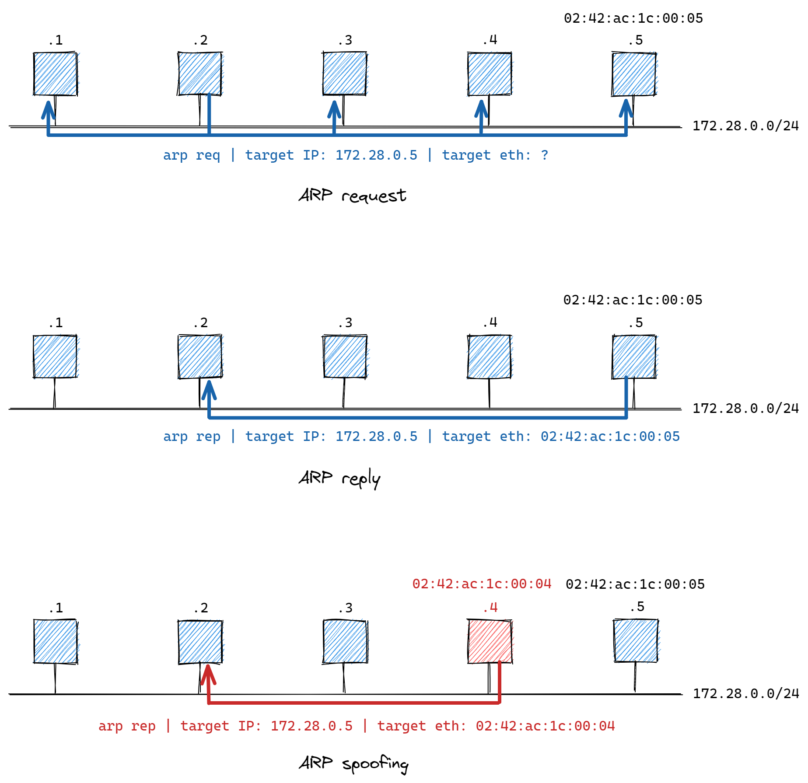

# **Sigurnost računala i podataka** <!-- omit in toc -->

- [Lab 1: Man-in-the-middle attack (ARP spoofing)](#lab-1-man-in-the-middle-attack-arp-spoofing)
  - [ARP spoofing](#arp-spoofing)
  - [Zadatak](#zadatak)
  - [Linux tools and commands](#linux-tools-and-commands)

## Lab 1: Man-in-the-middle attack (ARP spoofing)

U okviru vježbe upoznajemo se s osnovnim sigurnosnim prijetnjama i ranjivostima u računalnim mrežama. Analizirat ćemo ranjivost _Address Resolution Protocol_-a (_ARP_) koja napadaču omogućava izvođenje _man in the middle (MitM)_ i _denial of service (DoS)_ napada na računala koja su dio iste lokalne mreže (_LAN-a_).

### ARP spoofing

<p align="center">

</p>

### Zadatak

Realizirati _man in the middle (MitM)_ napad iskorištavanjem ranjivosti ARP protokola. Student će testirati napad u virtualiziranoj [Docker](https://docs.docker.com/get-started/overview/) mreži ([Docker container networking](https://docs.docker.com/network/)) koju čine 3 virtualizirana Docker računala (eng. _container_): dvije _žrtve_ `station-1` i `station-2` te napadač `evil-station`.

U nastavku su upute za pokretanje navedene mreže na lokalnom računalu.

1. Pokrenite Windows terminal aplikaciju i u istoj otvorite Ubuntu terminal na WSL (_Windows Subsystem for Linux_) sustavu.

2. Pozicionirajte se u odgovarajući direktorij prema uputama profesora.

3. U navedenom direktoriju klonirajte ovaj GitHub repozitorij:

   ```console
    git clone https://github.com/mcagalj/SRP-2021-22
   ```

4. Uđite u direktorij `arp-spoofing/`:

    ```console
    cd SRP-2021-22/arp-spoofing/
    ```

    U direktoriju se nalaze skripte `start.sh` i `stop.sh` koje možete pozvati za pokretanje/zaustavljanje virtualiziranog mrežnog scenarija. Ovdje se također nalaze `docker` i `docker-compose` konfiguracijske datoteke kojima su opisana Docker virtualna računala i odgovarajuća virtualna mreža. Za uvid u sadržaj navedenih skripti i konfiguracijskih datoteka možete izvršiti sljedeću naredbu u direktoriju `arp-spoofing/`:

    ```console
    code .
    ```

    Na ovaj način otvarate editor _Visual Studio Code_ unutar kojeg možete vidjeti detalje skripti i datoteka.

5. Daljnje korake i upute student će dobiti u realnom vremenu na samim labovima.

### Linux tools and commands

1. Running bash scripts

    ```console
    $ ./start.sh
    $ ./stop.sh
    ```

2. Open an interactive shell (`bash`) in a container `station-1`

    ```console
    $ docker exec -it station-1 bash
    ```

3. Tools to be used on the container

    ```console
    $ whatis ping tcpdump arpspoof netcat
    ping       - send ICMP ECHO_REQUEST to network hosts
    tcpdump    - dump traffic on a network
    arpspoof   - intercept packets on a switched LAN
    netcat     - arbitrary TCP and UDP connections and listens
    ```